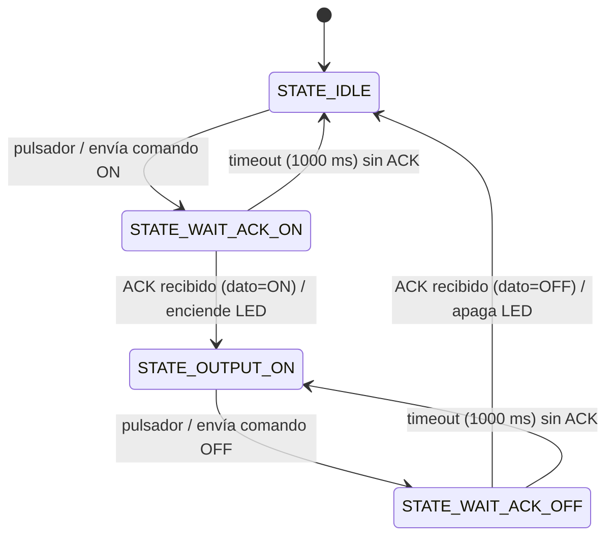
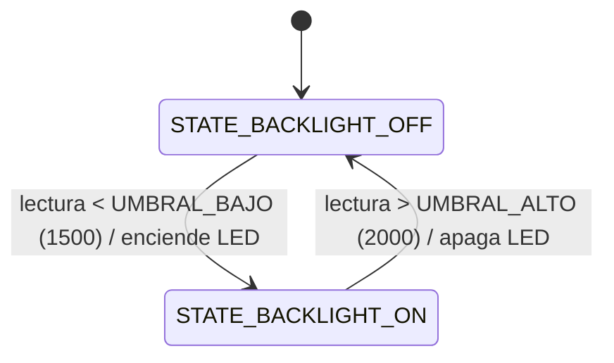

# TP_Final — Tablero de comandos automotriz reducido sobre CAN Bus

**Materia:** Programación de Microcontroladores — Carrera de Especialización en Sistemas Embebidos (CESE, FIUBA)
**Docente:** Mg. Ing. Patricio Bos
**Alumno:** Prof. Ing. Daniel Márquez
**Plataforma:** NUCLEO-STM32F446RE

---

## 1. Descripción general

El proyecto implementa una versión reducida de un **tablero de comandos automotriz** para activación/desactivación de una salida (relé o estado sólido), comunicado mediante **CAN Bus**.

- La **NUCLEO-F446RE** actúa como el tablero: un pulsador emula uno de los botones del panel, y un LED confirma visualmente cuando la acción fue efectivamente reconocida.
- Un **analizador CAN por USB**, conectado a una PC, emula la caja de salidas: recibe los comandos del tablero y responde con un mensaje de reconocimiento (ACK).
- Adicionalmente, un **LDR** mide la luz ambiente y controla un **LED de backlight** con histéresis, simulando la iluminación nocturna del panel de comandos.
- Toda la actividad CAN (mensajes enviados, recibidos, y timeouts sin respuesta) se reporta por **UART** a una terminal serie, para depuración.

## 2. Hardware

| Elemento | Detalle |
|---|---|
| Placa | NUCLEO-STM32F446RE |
| Transceiver CAN | MCP2551 (alimentado a 5V) |
| Bus CAN | 125 kbps, terminación 120Ω en ambos extremos |
| Sensor de luz | LDR + resistencia fija (divisor resistivo), o potenciómetro para simulación |
| LED de confirmación (tablero) | LD2 (LED de usuario integrado en la placa) |
| LED de backlight | LED externo en PB4 |
| Pulsador | B1 (pulsador de usuario integrado en la placa, PC13) |
| Analizador CAN | Cualquier adaptador USB-CAN compatible, configurado a 125 kbps, ID estándar |

### Conexionado

| Señal | Pin NUCLEO | Notas |
|---|---|---|
| CAN1_TX | PA12 | Conector Morpho CN10, pin 12 |
| CAN1_RX | PA11 | Conector Morpho CN10, pin 14 (tolerante a 5V — pin FT) |
| LDR (wiper del divisor) | PA0 (A0) | Entrada ADC1_IN0 |
| LED backlight | PB4 (D5) | GPIO salida |
| UART debug | PA2/PA3 | USART2, mismo puerto virtual (VCP) del ST-LINK, 115200 bps 8N1 |

## 3. Arquitectura de software

El proyecto sigue el criterio de **separación entre lógica genérica y capa de hardware** en cada driver, dividiendo la codificación en dos archivos fuente por módulo (`<driver>.c` + `<driver>_port_stm32f4xx.c`), con un único header público por driver.

```
TP_Final/
├── Core/                        # Generado por CubeMX (no se edita fuera de USER CODE)
├── Drivers/
│   ├── STM32F4xx_HAL_Driver/    # HAL de ST
│   ├── CMSIS/
│   └── API/                     # Drivers propios, reutilizables entre proyectos
│       ├── Inc/
│       │   ├── API_can.h
│       │   ├── API_debounce.h
│       │   ├── API_uart.h
│       │   ├── API_ldr.h
│       │   └── API_delay.h
│       └── Src/
│           ├── API_can.c
│           ├── API_can_port_stm32f4xx.c
│           ├── API_debounce.c
│           ├── API_debounce_port_stm32f4xx.c
│           ├── API_uart.c
│           ├── API_uart_port_stm32f4xx.c
│           ├── API_ldr.c
│           ├── API_ldr_port_stm32f4xx.c
│           └── API_delay.c
└── MEF/                         # Lógica específica de esta aplicación
    ├── Inc/
    │   ├── mef_keypad.h
    │   └── mef_backlight.h
    └── Src/
        ├── mef_keypad.c
        ├── mef_keypad_port_stm32f4xx.c
        ├── mef_backlight.c
        └── mef_backlight_port_stm32f4xx.c
```

### Criterio de diseño: genérico + port

Cada driver en `Drivers/API` separa:
- **`<driver>.c`**: lógica de alto nivel, validaciones, sin ninguna dependencia de HAL ni de STM32. Es la parte reutilizable si se portara el proyecto a otro microcontrolador.
- **`<driver>_port_stm32f4xx.c`**: único archivo que incluye `stm32f4xx_hal.h` y llama funciones HAL. Es la parte que se reescribiría al cambiar de plataforma.

**Encapsulamiento entre ambos archivos**: las funciones internas del driver (por ejemplo `can_port_Init`, `can_port_write`) se declaran con `extern` directamente en el `.c` que las consume, **no** en el header público. Así, `main.c` y el resto de la aplicación solo ven la interfaz pública declarada en `<driver>.h`, sin acceso a los detalles de implementación del port. Es una convención de diseño (C no tiene un modificador real de visibilidad entre archivos distintos que a la vez necesiten verse entre sí), documentada con comentarios en cada punto de uso.

**Reutilización de los handles generados por CubeMX**: ningún driver crea su propio `UART_HandleTypeDef`/`CAN_HandleTypeDef`/`ADC_HandleTypeDef`. Cada `port` declara `extern` sobre el handle global que ya inicializa `MX_..._Init()` (`hcan1`, `huart2`, `hadc1`), evitando una doble fuente de configuración del mismo periférico físico.

### Convención de idioma

Por pedido de la cátedra de no mezclar idiomas: **identificadores de código en inglés** (funciones, variables, tipos, macros), **comentarios y documentación en castellano**. Excepción deliberada: el prefijo `mef_` de los módulos de máquina de estados se mantiene en castellano por decisión personal del autor.

## 4. Módulos — Drivers (`Drivers/API`)

### `API_can` — Comunicación CAN

| Función | Descripción |
|---|---|
| `bool_t can_Init(void)` | Inicializa el driver (filtro de recepción, arranque del periférico, activación de interrupción RX0). |
| `bool_t can_write_msg(can_msg_t *message)` | Transmite un mensaje CAN (polled). |
| `void can_read_msg_callback(can_msg_t *message)` | Callback `__weak`, redefinido por la aplicación para procesar mensajes recibidos (interrupt-driven). |

**Configuración:** CAN1, 125 kbps (Prescaler 21, TS1 13tq, TS2 2tq, SJW 1tq — sample point 87.5%), filtro en modo máscara `0x0000` (acepta todos los ID), recepción en FIFO0 con interrupción, transmisión por polling.

### `API_debounce` — Antirrebote de pulsador

| Función | Descripción |
|---|---|
| `void debounceFSM_init(void)` | Inicializa la MEF de antirrebote. |
| `void debounceFSM_update(void)` | Actualiza la MEF (llamar periódicamente). |
| `bool_t readKey(void)` | Devuelve `true` una vez por cada pulsación confirmada, y resetea la bandera. |

MEF de 4 estados (`BUTTON_UP`, `BUTTON_FALLING`, `BUTTON_DOWN`, `BUTTON_RISING`) con retardo no bloqueante de 40 ms para confirmar flancos.

### `API_uart` — Comunicación serie (debug)

| Función | Descripción |
|---|---|
| `bool_t uartInit(void)` | Verifica la inicialización de USART2 y envía un mensaje de bienvenida. |
| `void uartSendString(uint8_t *pstring)` | Envía un string hasta `'\0'`. |
| `void uartSendStringSize(uint8_t *pstring, uint16_t size)` | Envía una cantidad fija de bytes. |
| `void uartReceiveStringSize(uint8_t *pstring, uint16_t size)` | Recibe una cantidad fija de bytes (polling). |

**Configuración:** USART2, 115200 bps, 8N1, sobre el mismo puerto virtual del ST-LINK.

### `API_ldr` — Lectura de luz ambiente

| Función | Descripción |
|---|---|
| `bool_t ldr_Init(void)` | Verifica la inicialización de ADC1. |
| `uint16_t ldr_ReadValue(void)` | Dispara una conversión y devuelve el resultado (0–4095, polling). |

**Configuración:** ADC1, canal IN0 (PA0), 12 bits, conversión única por polling (técnica elegida por ser una señal de variación lenta, sin necesidad de interrupción ni DMA).

### `API_delay` — Retardo no bloqueante (base, reutilizado de prácticas previas)

Provee `delay_t`, `delayInit`, `delayRead`, `delayWrite`, `delayIsRunning` — temporización basada en `HAL_GetTick()`, usada por `API_debounce` y ambas MEFs para sus timeouts/períodos sin bloquear el `while(1)`.

## 5. Módulos — Lógica de aplicación (`MEF`)

### `mef_keypad` — MEF del tablero (pulsador + CAN)

Gestiona la pulsación del botón, el envío del comando por CAN, la espera del ACK, y el LED de confirmación.

**Protocolo de mensajes CAN diseñado:**

| Mensaje | ID | Dato |
|---|---|---|
| Comando (Nucleo → caja de relés) | `0x100` | `0x01` = activar, `0x00` = desactivar |
| ACK (caja de relés → Nucleo) | `0x200` | Se repite el mismo dato recibido en el comando |

Esta decisión da **doble control**: el ID confirma que es un ACK, y el dato confirma de qué acción se trata — sin necesitar IDs distintos por cada tipo de evento.

**Diagrama de estados:**



| Estado | Descripción |
|---|---|
| `STATE_IDLE` | Reposo. LED apagado. Espera pulsación. |
| `STATE_WAIT_ACK_ON` | Comando de activación enviado. Espera ACK por interrupción RX0. Timeout vuelve a Idle. |
| `STATE_OUTPUT_ON` | Salida confirmada activa. LED encendido. Espera pulsación para desactivar. |
| `STATE_WAIT_ACK_OFF` | Comando de desactivación enviado. Espera ACK. Timeout permanece en Output ON (no hay confirmación de que se haya desactivado). |

**Transmisión:** polled driver. **Recepción:** interrupt-driven driver (según lo requerido por la consigna).

**Logging por UART:** cada mensaje TX/RX se reporta con ID, DLC y datos en hexadecimal; cada timeout se reporta indicando qué acción esperaba confirmación. El callback de interrupción (`can_read_msg_callback`) solo copia datos y levanta banderas — el logging real ocurre en `mef_keypad_update()`, fuera de la ISR, para no bloquear la interrupción con una transmisión UART.

### `mef_backlight` — MEF de backlight (LDR + histéresis)

Lee el LDR cada 100 ms y controla el LED de backlight con dos umbrales (histéresis), evitando parpadeo ante lecturas ruidosas cerca de un único umbral.



| Estado | Descripción |
|---|---|
| `STATE_BACKLIGHT_OFF` | Ambiente con luz suficiente. LED apagado. |
| `STATE_BACKLIGHT_ON` | Ambiente oscuro detectado. LED encendido. |

Los umbrales (`1500`/`2000`, sobre escala 0–4095) son valores de partida; requieren calibración según el divisor resistivo y ambiente reales.

## 6. Compilación y carga

1. Abrir `TP_Final.ioc` en STM32CubeIDE.
2. Verificar en **Properties → C/C++ General → Paths and Symbols**:
   - **Includes**: `Drivers/API/Inc`, `MEF/Inc`
   - **Source Location**: `Drivers/API`, `MEF`
3. Build (Ctrl+B) y Run/Debug para cargar el firmware.

## 7. Prueba del sistema

1. Conectar el módulo transceiver MCP2551 (PA11/PA12/5V/GND) y el analizador CAN al bus (125 kbps, terminación 120Ω en ambos extremos, GND común).
2. Abrir una terminal serie al puerto COM de la Nucleo (115200 bps 8N1) para ver el log de mensajes CAN.
3. Presionar el botón **B1**: debería verse por CAN un mensaje `TX - ID: 0x100 - DLC: 1 - Datos: 0x01`.
4. Desde el analizador, enviar un ACK: ID `0x200`, dato `0x01` → el LED **LD2** debe encenderse, y el log debe mostrar el `RX` correspondiente.
5. Repetir la secuencia inversa (dato `0x00`) para confirmar la desactivación.
6. Para probar el backlight sin el LED externo conectado, puede usarse un potenciómetro (3V3–GND, wiper a PA0/A0) simulando el LDR, y observar la reacción en el LED de backlight (o su espejo temporal en LD2, si se dejó habilitado para pruebas).
